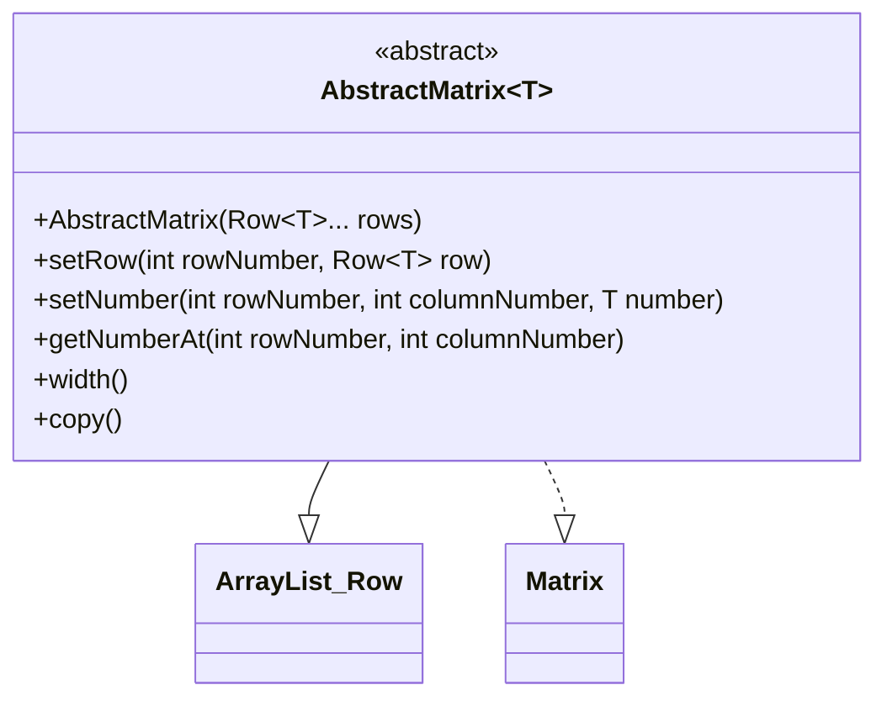

# Dokumentasjon prosjekt

## Beskrivelse

For å lære både TMA4115 og TDT4100 på en gang har jeg dette semesteret jobbet med å programmere store deler av pensumet i matte 3 - lineær algebra. I pakken "fundament" har jeg klasser som definerer noen av de grunnleggende strukturene i lineær algebra. Pakken "gausseliminasjon" inneholder klasser som lar brukeren gausseliminere en matrise - som er sentralt når man skal finne inversen til en matrise. Pakken "kalkulasjoner" viser wrapper opp utregningene. Her lar "EquationSolver" oss løse likningssett, "InverseMatrixCalculator" lar oss beregne inversen til en matrise, og "ProjectionCalculator" lar oss regne ut projeksjonen av en vektor på et gitt vektorrom. Pakkene "Operators" og "Validators" byr på støttefunksjoner til resten av programmet.

Brukergrensesnittet bygger på ideen fra "InverseMatrixCalculator". Brukeren får en 3x3 matrise med en invers der alle entries er heltall, og skal på kortest mulig tid regne ut og taste inn inversmatrisen. Fasiten regnes ut av "InverseMatrixCalculator". Tiden lagres i en highscore-list som skrives til fil.

## Klassediagram AbstractMatrix

## Spørsmål

### Spørsmål 1
Jeg utnytter at matriser er en samling av rader, og at rader er en samling av tall, omtrent som en transponert vektor. Dette gjør jeg ved at radklassen arver ArrayList<Double> og matriseklassen arver ArrayList<Row>. Dette gjør at jeg sparer meg for mye arbeid, siden mange metoder jeg trenger allerede er implementert. En utfordring med dette, en nokså seriøs utfordring, er at jeg har lite kontrol over de metodene jeg arver, men som ikke er ment til å brukes.

Jeg ønsker å skrive kode som lar meg gjøre de samme beregningene som jeg gjør med reelle matriser på komplekse matriser. Derfor har jeg nå laget Matrix-grensesnittet som RealMatrix implementerer. Tanken er at det skal være mulig å lage en ComplexMatrix-klasse som implementerer Matrix-grensesnittet, og som jeg kan utføre de samme beregningene på. Merk: Det er flere justeringer som må gjøres i koden før en slik funksjonalitet blir realitet. 

### Spørsmål 2
Jeg dekker hele pensum.

### Spørsmål 3

Koden har en tydelig Model-View-Controller-struktur, der App-klassen tar seg av brukergrensesnittet, App-pakken tar seg av logikken, og controller-klassen bruker App-pakken til å styre brukergrensesnittet.

### Spørsmål 4

For å teste koden har jeg gjennom utviklingsfasen kontinuerlig brukt en main-metode for å sørge for at hvert enkelt steg fungerer som det skal. I etterkant har jeg erfart at når jeg senere går gjennom og gjør store eller små endringer i koden, ville det vært en fordel om jeg fra starten av hadde skrevet ordentlige og grundige unittester. Jeg har nå skrevet tester på et knippe av klassene som jeg ser som sentrale for at den delen av prosjektet som dreier seg om brukergrensesnittet.